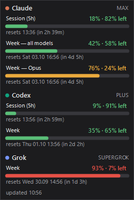

# AI Usage Counter

[](https://github.com/DilyaSoft/AI-Usage-Counter/actions/workflows/ci.yml)
[](LICENSE)

A small always-on-top Windows widget that shows how much of your AI coding subscription limits you have used:
the current session window, the weekly limit, per-model limits, and when each one resets.



It detects which CLIs you are signed in to and only shows those. If you only use Claude Code, you only see Claude.

| Service | Detected when this file exists | Override dir with | What is shown |
|---|---|---|---|
| Claude (Pro / Max) | `~/.claude/.credentials.json` | `CLAUDE_CONFIG_DIR` | 5-hour session, weekly (all models), weekly per-model |
| Codex (ChatGPT Plus / Pro) | `~/.codex/auth.json` (ChatGPT login) | `CODEX_HOME` | 5-hour and weekly windows, extra limits |
| Grok (SuperGrok) | `~/.grok/auth.json` | `GROK_HOME` | Credit usage for the current period |

## Requirements

- Windows 10 or 11, x64
- At least one of: [Claude Code](https://claude.com/claude-code), [Codex CLI](https://github.com/openai/codex), Grok CLI, signed in with your subscription
  (`/login`, `codex login`, `grok login`)

## Install

Download `AIUsageCounter.exe` from [Releases](https://github.com/DilyaSoft/AI-Usage-Counter/releases) and run it.
The exe is self-contained, so you do not need to install .NET.
Each release also has a `.sha256` file you can use to check the download:
`(Get-FileHash AIUsageCounter.exe).Hash`.

The exe is not code-signed, so Windows SmartScreen may warn on first run (**More info → Run anyway**).

Or build it yourself (needs the .NET 8 SDK):

```powershell
.\publish.ps1          # runs tests, builds publish\AIUsageCounter.exe (self-contained, ~70 MB)
.\publish.ps1 -Small   # framework-dependent build (~0.3 MB, needs .NET 8 Desktop Runtime)
```

## Usage

- Drag the widget anywhere. It remembers its position.
- Double-click to refresh right away. By default it refreshes every 5 minutes.
- Right-click menu:
  - **Refresh**
  - **Services**: show or hide individual services
  - **Always on top**
  - **Opacity**
  - **Refresh interval**
  - **Start with Windows**
  - **Open usage page**
  - **Exit**

Settings are stored in `%APPDATA%\AIUsageCounter\settings.json`.

## How it works and privacy

The widget reads the OAuth token that each CLI has already saved on your machine and calls the same usage endpoint the CLI uses for its own `/usage` or `/status` screen:

- Claude: `GET https://api.anthropic.com/api/oauth/usage`
- Codex: `GET https://chatgpt.com/backend-api/wham/usage`
- Grok: `GET https://cli-chat-proxy.grok.com/v1/billing?format=credits`

These requests only read usage numbers. They do not send prompts and do not use up any of your limits.
Tokens are sent only to the service they belong to, never anywhere else.

The widget **never refreshes tokens**. Refreshing would rotate the CLI's refresh token and sign the CLI out.
When a token expires, the widget shows `token expired — run <cli>`. Open that CLI once and the widget recovers on its next refresh.
This happens most with Grok, whose tokens only last a few hours.

> These endpoints are undocumented internal APIs. A provider can change them at any time, and the widget will then show an error for that service until it is updated.

## Adding another service

1. Add a client next to `src/AIUsageCounter/CodexClient.cs`. It reads the CLI's login file and returns a `UsageSection` with a list of `UsageLimit(title, percent, resetsAt)`.
2. Register it in `Providers.All` in `src/AIUsageCounter/Providers.cs` with a name, color, usage page URL, detection check and fetch function.
3. Add tests in `tests/AIUsageCounter.Tests`, using `FakeHandler` for HTTP and `TempDir` for login files.

## Development

```powershell
dotnet test AIUsageCounter.sln
dotnet run --project src\AIUsageCounter
dotnet run --project src\AIUsageCounter -- --demo   # sample data, reads no credentials
```

## Security

See [SECURITY.md](SECURITY.md). Please report vulnerabilities privately, not in public issues.

## License

[MIT](LICENSE)
